# Capsule Network

## CNN 存在的挑战

在深度学习中，CNN擅长抽取 **feature**，但是对于各个 **feature** 之间的空间关系解释的不够高效。例如下图中的图像，简单的CNN网络会认为它是一个人脸素描。

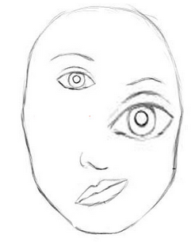

一个简单的CNN可以正确地抽取诸如 **嘴**，**鼻子**，**眼睛** 这样的相关信息，但是它不能识别这些特征的空间信息，于导致针对于脸的识别率过高。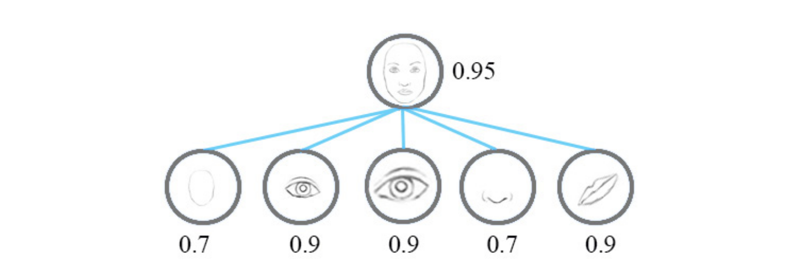

现在，我们做如下考虑，我们不仅考虑 **feature** 的相似度，我们还考虑 **feature** 的空间信息，比如大小和方向。我们把之前每个神经元的输出认作这个 **feature** 的可能性，我们现在把每个神经元当做一个 **向量**，表示为 **(likehood, orientation, size)**。在这些空间信息的参与下，我们会发现这个图像的 眼睛，鼻子，嘴巴的空间信息并不是很合适，于是它判断为人脸的可能性也会随之降低。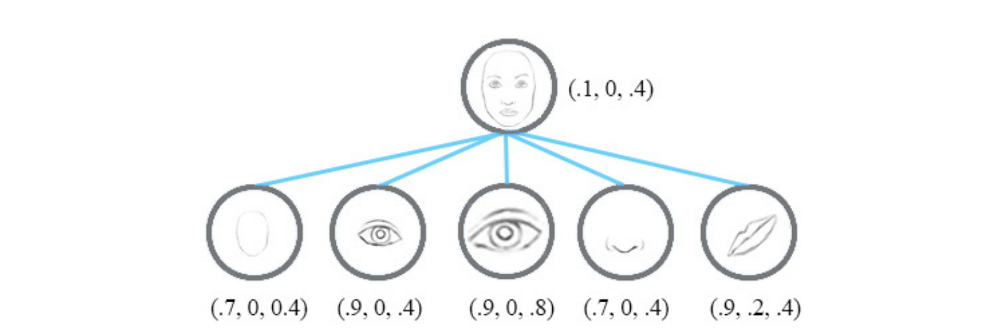

## Equivariance(同变性)
理论上来讲，Capsule Network 相对于 CNN 会更为简单，因为 相对于具有 **Equivariance** 的两个 **feature** CNN不能直接识别为相同的 **feature**，而Capsule Network识别出来它们只是简单地做了空间变换，如下图所示：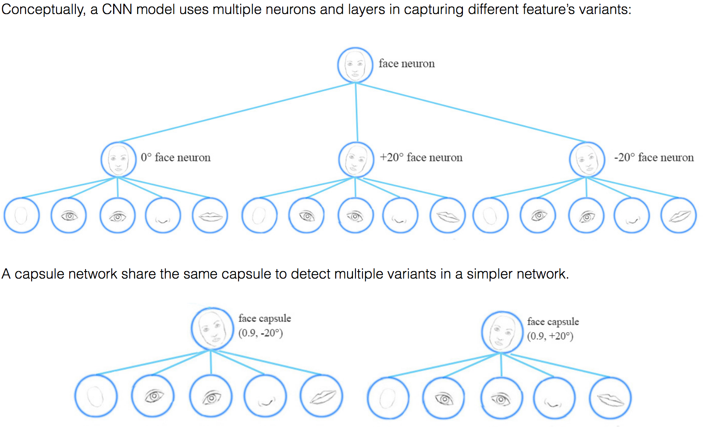
我的理解是这样的，作为一个 CNN 网络就像下图所示，它做识别的时候，不会直接认为做了旋转的脸是脸，至少要通过其它步骤才能识别出来它是脸旋转得来的。而 Capsule Network 会直接认为它是带有旋转的脸。所以

## Capsule
Capsule 可以看做是神经网络的一个集合，它不仅包含**相似性信息(likehood)**，还包括其它指定的特征。如下图所示：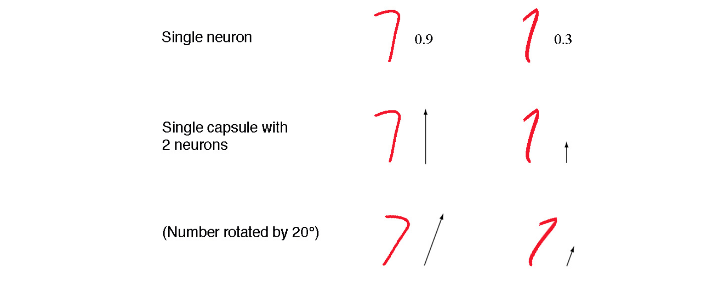
在第一行中，我们使用一个单一的神经元来预测它是 **7** 的可能性，在第二三行中我们添加了一个属性 **方向**，我们可以采用某种策略来进行判定，比如我们认为第一个数字的向量为 $\mathbf{v} = (0, 9) \text{并按照如下方式进行判断：} \parallel v \parallel = \sqrt{0^2 + 0.9^2}=0.9$。我们还可以向着capsule中添加其它的 神经元 来丰富这个capsule。

## Dynamic routing
Dynamic routing 组合 capsule 产生 父capsule，并且它计算每个 capsule 的输出。
下面从直觉的角度来讲一下 **Dynamic routing** 的过程。如下图所示，存在三个脸部素描：
我们测试每个素描眼睛和嘴巴的水平宽度分别为 $$s^{(1)}=(100,66)~~~~s^{(2)}=(200,131)~~~~s^{(3)}=(50,33)$$ 我们假定 $W_m=2, W_e=3$ 然后我们通过 capsule 计算一个 **vote** 对于 $s^{(1)}$ 而言：$$v_m^{(1)} = W_m \times width_m = 2 \times 200 = 200 \\
v_e^{(1)} = W_e \times width_e = 3 \times 66 = 198$$ 我们发现 $v_e^{(1)}$ 和 $v_m^{(1)}$ 非常相近，这个特点在其它素描上也有体现。根据经验我们知道嘴巴和眼睛的宽度比例就是 $3:2$， 所以我们可以识别父capsule为一个脸部素描。当然，我们可以通过添加其它的一些属性来使得判断更为准确。

在 **Dynamic routing** 的过程中我们将一个输入 capsule 通过一个 转换矩阵（transformation matrix）W 形成一个 vote，并且将具有相似投票的capsule分组。这些投票最终形成父capsule的输出向量。 

## Calculating a capsule out
对于一个capsule而言，输入Capsule $u_i$ 和 输出Capsule $v_j$ 是矩阵，如下图所示: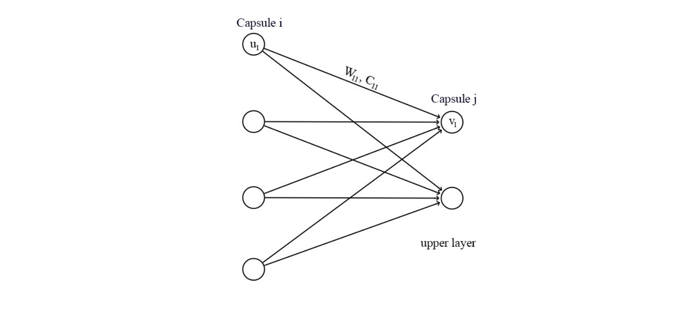
我们采用 $\mathbf{transformation}~\mathbf{matrix}~\mathbf{W}_{ij} $ 计算前一层的 capsule $\mathbf{u}_i$。举例来说，我们使用一个 $p\times k$ 矩阵，将 $u_i$ 转换为 $\widehat{u}_{j\mid i}$($(p\times k) \times (k\times 1) \Rightarrow p\times 1$)。接下来我们通过 **weghts** $c_{ij}$ 来计算一个 **weighted sum** $s_j$ :	

​										$$\widehat{u}_{j\mid i} = W_{ij}u_i \\
s_j=\sum_ic_{ij}\widehat{u}_{j\mid i}$$

$c_{ij}$是**耦合系数(coupling coefficients)**，它通过 **iterative dynamic process** 进行计算（下面会讨论到）。从理论上来说，$c_{ij}$用于测量 capsule i 激活 capsule j 的可能性。

我们设计了一个squashing 函数，用以替代激活函数，它作用于 $s_j$，以用来保证 $v_j$中的项在 0 和 1 之间。这个函数将小向量缩水为0向量，大向量变成单位向量。$$v_j = \frac{\parallel s_j \parallel^2}{1 + \parallel s_j \parallel^2} \frac{s_j}{\parallel s_j \parallel} \\
v_j \approx \parallel s_j \parallel s_j \qquad 如果 s_j 很小 \\
v_j \approx \frac{s_j}{\parallel s_j \parallel} \qquad 如果s_j 很大$$

## iterative dynamic process
在 capsule 中，我们使用 **iterative dynamic process** 来计算 capsule 的的输出，这里我们计算一个中间值 c_{ij}，也就是我们前文提到的 **耦合系数(coupling coefficient)**。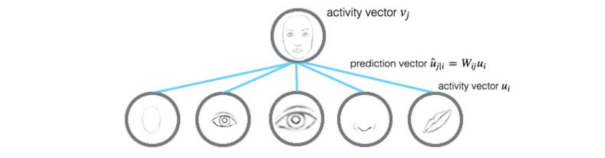

回顾我们之前的计算:$$\widehat{u}_{j\mid i} = W_{ij}u_i \\
s_j=\sum_ic_{ij}\widehat{u}_{j\mid i} \\
v_j = \frac{\parallel s_j \parallel^2}{1 + \parallel s_j \parallel^2} \frac{s_j}{\parallel s_j \parallel}$$

从直觉上来说，$\widehat{u}_{j \mid i}$ 是 capsule i 在capsule j 的输出上的 **preduction（vote）**。如果激活向量（activity vector）和 这个 preduction 十分接近，那么我们可以说这二者是十分相关的。这个相似性是通过 **preduction** 和 **activity vector**的内积来测量的：$$b_{ij} \leftarrow \widehat{u}_{j \mid i} \cdotp v_j$$

这个相似性分数（similarity score）$b_{ij}$ 将**相似性**和其它**特征属性**都考虑在内了。同样，如果 $u_i$ 比较小，那么 $b_{ij}$ 也会比较小，因为 $b_{ij}$ 依赖于 $\widehat{u}_{j \mid i}$，而 $\widehat{u}_{j \mid i}$ 正比于 $u_i$。

耦合系数(coupling coeffients) $c_{ij}$按照如下方式计算:$$c_{ij} = \frac{\exp b_{ij}}{\sum_k \exp b_{iK}}$$

为了使 $b_{ij}$ 更准确一点我们多次迭代更新（通常采用三次迭代）。$$b_{ij} \leftarrow b_{ij} + \widehat{u}_{j \mid i} \cdotp v_j$$

下面是 **Dynamic routing** 最终的伪代码

1. **procedure** ROUTING($\widehat{u}_{j \mid i}, r, l$)
2. $\qquad$ for all capsule $i$ in layer l and capsule $j$ in layer $(l + 1)$: $b_{ij} \leftarrow 0$.
3. $\qquad$ **for** $r$ iterations **do**
4. $\qquad$$\qquad$ for all capsule $i$ in layer $l$: $\mathbf{c_i} \leftarrow \mathbf{softmax}(\mathbf{b_i})$
5. $\qquad$$\qquad$ for all capsule $j$ in layer $(l + 1)$: $\mathbf{s_j} \leftarrow \sum_ic_{ij} \widehat{\mathbf{u}}_{j \mid i}$
6. $\qquad$$\qquad$ for all capsule $j$ in layer $(l + 1)$: $\mathbf{v}_j \leftarrow \mathbf{squash}(\mathbf{s_j})$
7. $\qquad$$\qquad$ for all capsule $i$ in layer $i$ and capsule $j$ in layer $(l + 1)$: $b_{ij} \leftarrow b_{ij} + \widehat{\mathbf{u}}_{j \mid i}\cdotp v_j$
8. $\qquad$ **return** $v_j$

## Max pooling 的缺点
max pooling 只会保留前一层网络的最大 feature，而丢弃其它的的 feature。Capsule 保留了前一层网络的 feature 的 weighted sum。所以对于识别叠加的特征，Capsule 比 Max pooling 更合适。

## CapsNet architecture
下面我们来描述一下这个网络架构: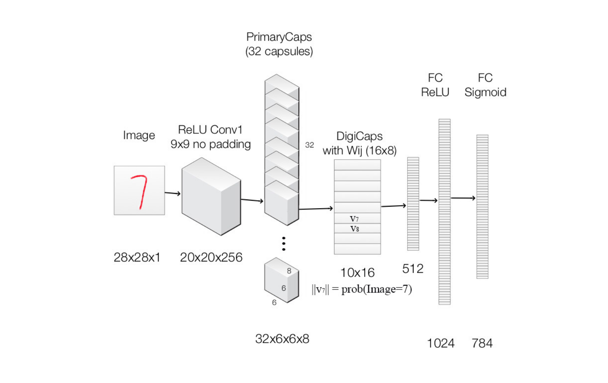

我们使用这个网络来进行 MNIST 数据集上的的手写数字识别。  

1. 首先图片喂给一个标准的 ReLU Conv层。它使用 $256 \times 9 \times 9$ 卷积核产生了一个 $256 \times 20 \times 20$的输出。  
2. 之后 $1.$ 中的输出喂给 PrimaryCapsule 他是一个修改过的支持capsule的卷积层。它产生一个 8-D 的 向量来替代一个值。PrimaryCapsule 使用 $8\times 32$ 的卷积核来产生 32 8-D capsules（可以使用8个神经元组合在一起来产生一个capsule），PrimaryCapsule 使用 $9 \times 9$ 的卷积核并且 $strid=2$来进行降维，最终产生 $32 \times 6 \times 6$ 个capsule（$20 \times 20 \Rightarrow 6 \times 6~~~~\lfloor\frac{20-9}{2}\rfloor + 1 = 6$）。  
3. 之后我们进入 DigiCaps 这里我们使用  $16 \times 8$ 转换矩阵 $\mathbf{W_{ij}}$ 将 8-D capsule 转化为 10-D capsule。  
4. 之后我们使用激活函数为 $\mathbf{ReLU}$ 的 fully connected layer来进行分类的最后一步，具体的网络如下所示。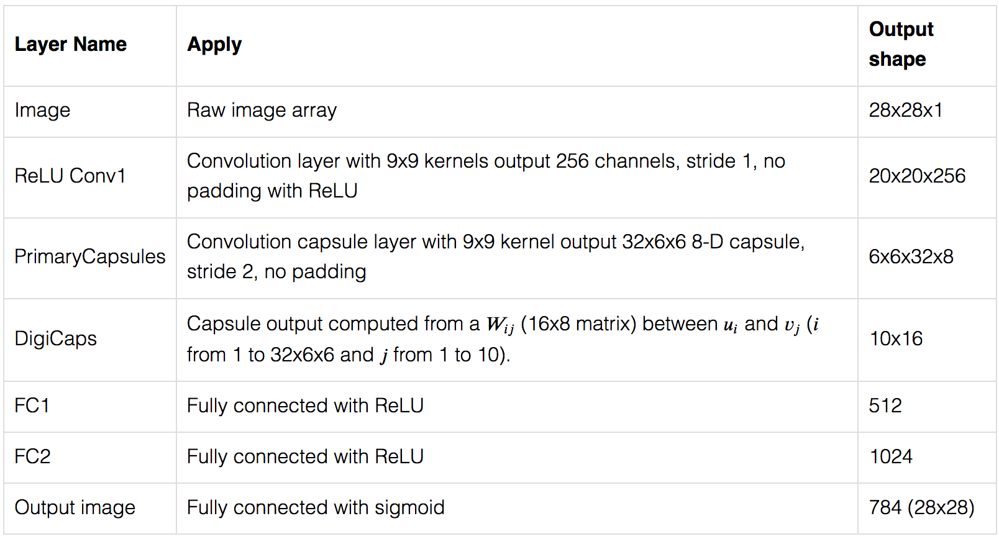

## Loss Function
代价函数采用margin loss（这个我没有看过，也不知道为啥用这个，可能之后会补充）。对于每个分类有如下公式：$$L_c=T_c\max(0, m^+ -\parallel v_c \parallel)^2 + \lambda(1-T_c)\max(0, \parallel v_c \parallel - m^-)^2$$
其中如果c类被正确识别 $T_c=1$。其他参数采用如下数据$$m^+=0.9\\
m^-=0.1\\
\lambda=0.5$$总损失就是单个类别的损失之和。

# Matrix capsule 
下面我们来介绍另外一种capsule，**Matrix capsule**。

## Matrix capsule 
matrix capsule 拥有一个neuron一样的 **activation（likeliness）**，和一个 $4 \times 4$ 的 **pose matrix**。在计算机绘图中，一个 **pose matrix** 定义了一个物体的平移和旋转，它相当于一个物体针对不同视角的转换。
举例来说，下面两行图像是一个相同物体的不同视角的图像，在 **matrix capsule** 中，我们训练模型来获取这个 **pose information**。当然，和其他深度学习网络一样，这是我们的猜想，他不能得到验证。
**EM(Expection Maximization) routing**的目的是通过EM算法将capsule进行分类来形成一个 **part-whole**关系。在面部识别的例子中，每一个在底层的嘴唇，眼睛，鼻子capsule都在他的父capsule的**pose matrix**产生一个prediction（vote）。每一个vote都是一个父 capsule 的 **pose matrix**的预测值，他通过自己的**pose matrix** $\mathbf{M}$ 乘以一个**transformation matrix** $\mathbf{W}$ 来计算。$$v=\mathbf{MW}$$

我们使用 **EM routing** 来将 **capsule** 分到父 **capsule** 中。比如说，鼻子，嘴唇，眼睛capsule他们vote了一个相似的 **pose matrix**，那么我们就将他们分配到一起，形成人脸capsule。

## Using EM for Routing-By_Agreement
一个高层的 **feature**（比如说人脸），通过寻找他下一层的 **capsule** 的**vote**的**一致（agreement）**来进行识别。**EM routing**用来聚类具有相似 **vote** 的 **capsule**。
对于capsule $i$ 针对 父 capsule $j$ 的 vote $v_{ij}$ 是通过他的 **pose matrix** $M_i$ 和一个 视角对称等值变换矩阵 $W_{ij}$ 相乘得来的$$v_{ij}=M_iW_{ij}$$

capsule $i$ 被分组进入 capsule $j$ **part-whole** 关系的概率是基于 vote $v_{ij}$ 和其他 vote $(v_{1j}, ...,v_{kj})$ 之间的接近程度来决定的。$W_{ij}$ 是通过 **backpropagation** 来学习的，他不仅学习一个上层 capsule 是由哪些下层 capsule 构成的，他还要确保父capsule 的 **pose information** 和他的 **sub-components** 在做了一些变换之后是相匹配的。

下面是一个 **routing-by-agreement** 的可视化。我们通过 **vote的相似度** 对capsule进行分组($T_iT_{ij} \approx T_hT_{hj}$)，这里的 **transformation matrix** 就是 $T_{ij}$ 和 $T_{hj}$ 
**EM routing** 是基于一致性的，因此即使视角改变，相同的子capsule也会被分到一起。

## Capsule assignment 
EM routing 聚类capsule 在运行中来形成一个更高层次的capsule。同时他也计算一个 **assigment probabilities** $r_{ij}$ 来量化 capsule 与其 父capsule 之间的运行间连接。举例来说，一个手臂是不属于人脸的一部分，所以这二者之间的连接就是0，如果嘴唇找一个 capsule 被阻塞了，那么他到人脸之间的连接也是0。

## Calculate capsule activation and pose matrix
Capsule 的输出的计算方式和神经网络不同。在 **EM clustering**，我们使用高斯分布来表示数据点。在 **EM routing** 中，我们把父capsule的 **pose matrix** 塑造成一个高斯分布。这个 **pose matrix** 是一个 $4 \times 4$ 的矩阵。我们使用高斯分布把这个 **pose matrix** 塑造为 16个 $\mu$ 和 16 个 $\sigma$，每一个 $\mu$ 代表着一个 **pose matrix** 的组成部分。

我们定义 $v_{ij}$ 为 capsule $i$ 对父capsule $j$ 的 vote，$v_{ij}^h$ 为他的第 $h$ 个组成部分。我们使用高斯概率密度公式$$p(x)=\frac{1}{\sigma\sqrt{2\pi}}e^{-(x-\mu)^2/(2\sigma^2)}$$
来计算 $v_{ij}^h$ 属于 capsule $j$ 的高斯模型的概率:$$p_{i \mi\begin{center} p(x)=\frac{1}{\sqrt{2\pi\sigma}}\exp[-\frac{1}{2}(\frac{x-\mu}{\sigma})^2]
\begin{center} d j}^h=\frac{1}{\sqrt{2\pi(\sigma_j^h)^2}}\exp(-\frac{(v_{ij}^h - \mu_j^h)^2}{2(\sigma_j^h)^2})$$
我们再在这个之上加一个自然对数：$$\begin{align}
\ln(p_{i \mid j}^h) &=\ln\frac{1}{\sqrt{2\pi(\sigma_j^h)^2}}\exp(-\frac{(v_{ij}^h - \mu_j^h)^2}{2(\sigma_j^h)^2}) \\
&=-\ln(\sigma_j^h) - \frac{\ln(2\pi)}{2} - \frac{(v_{ij}^h - \mu_j^h)^2}{2(\sigma_j^h)^2}
\end{align}$$

让我们来估计激活一个 capsule 的 **cost**。**cost**  越小，capsule 越有可能被激活。如果**cost** 很高，那么这个 vote 和父 capsule 的高斯分布就不是很匹配，因此也不会被激活。我们定义 $cost_{ij}$ 为 capsule $i$ 激活 capsule $j$ 的 **cost**，我们定义如下:$$cost_{ij}^h=-\ln(P_{i \mid j}^h)$$

因为并非所有的都同样与 capsule $j$ 连接，所以我们用 **assignment probabilities** $r_{ij}$ 按照比例地缩放cost。下一层的总体cost 描绘如下:$$\begin{align}
cost_j^i &= \sum_ir_{ij}cost_{ij}^h \\
&= \sum_i-r_{ij}\ln(p_{i\mid j}^h) \\
&= \sum_ir_{ij}(\ln(\sigma_j^h) + \frac{\ln(2\pi)}{2} + \frac{(v_{ij}^h - \mu_j^h)^2}{2(\sigma_j^h)^2}) \\
&= (\ln(\sigma_j^h) + k)\sum_ir_{ij}
\end{align}$$

我们使用下面的等式来判定 capsule $j$ 是否被激活:$$a_j = sigmoid(\lambda(b_j - \sum_hcost_j^h)$$
在原始论文中，“$-b$”被解释为描述 capsule $j$ 的均值和方差的 cost。我们不计算 $b_j$，它是通过 backpropagation 学习来的。

$r_{ij},\mu,\sigma$ 是通过 EM routing 迭代计算的，我们在下一节中讲述。$\lambda$ 代表着 inverse temperature paramater $\frac{1}{temperature}$。随着$r_{ij}$变得更好，我们会降低 $\lambda$，这样我们就可以增大sigmoid函数的坡度。它有助于帮助我们更好地调节 $r_{ij}$，因为这样在这个区域内他对 vote 的敏感度会高很多。$\lambda$ 被初始化为 1，每次迭代的过程中 +1，至于这么做的原因，论文中没有给出详细的解释。

## EM routing

输出 capsule 的 **pose matrix** 和 **activation** 是通过 **EM routing** 计算出来的。EM算法通过 **E-step** 和 **M-step** 将数据点匹配成高斯混合模型法。**E-step** 决定每个数据点到其父capsule的 **assignment probability** $r_{ij}$。**M-step** 基于 $r_{ij}$ 重新计算这个高斯混合模型。我们重复三次迭代。最后一次迭代产生的 $a_j$ 将作为父capsule 的输出。最后一次的迭代产生的高斯模型的16个$\mu$ 将会被填充到 父capsule的 $4\times 4$ pose matrix。

1. **procedure** EM ROUTING($\mathbf{a,V}$)
2. $\qquad$$\forall i \in \Omega_{L + 1}:\mathbf{R}_{ij} \leftarrow 1/ \mid \Omega_{L+1}\mid$
3. $\qquad$ **for** $t$ iterations **do**
4. $\qquad$$\qquad$ $\forall j \in \Omega_{L+1}: \mathbf{M-STEP}(\mathbf{a}, R, V, j)$
5. $\qquad$$\qquad$ $\forall i \in \Omega_L: \mathbf{E-STEP}(\mu,\sigma,\mathbf{a}, V, i)$
6. $\qquad$ return a,M

上面算法中的 a 和 V 是来自子capsule的 **activation** 和 **vote**。我们首先初始化 **assignment probabilty** $r_{ij}$ 为均匀分布，也就是说我们初始化每一个capsule都与父capsule有相同的连接关系。我们随后调用 **M-STEP** 通过 $a, \mathbf{V}$ 和现在的 $r_{ij}$ 来更新高斯模型 $(\mu,\sigma)$ 和 父capsule的 **activation** $a_j$。之后我们调用 **E-STEP** 基于新的高斯模型和新的 $a_j$ 来重新计算 **assignment probabilities** $r_{ij}$。

**M-STEP**计算如下：

1. **procedure** M-STEP($\mathbf{a},R,V,j$)
2. $\qquad$ $\forall i \in \Omega_L: R_{ij} \leftarrow R_{ij} * \mathbf{a}_i$
3. $\qquad$ $\forall h : \mu_j^h \leftarrow \frac{\sum_iR_{ij}V_{ij}^h}{\sum_iR_{ij}}$
4. $\qquad$ $\forall h: (\sigma_j^h)^2 \leftarrow \frac{\sum_iR_{ij}(V_{ij}^h-\mu_j^h)^2}{\sum_iR_{ij}}$
5. $\qquad$ $cost^h \leftarrow (\beta_v +\log(\sigma^h_j))\sum_iR_{ij}$
6. $\qquad$ $a_j \leftarrow sigmoid(\lambda(\beta_a-\sum_hcost^h))$ 

在 **M-STEP**中，我们基于子capsule 的 **activation**，当前的 $r_{ij}$ 和 **vote** V 来计算 $\mu$和$ \sigma$。 **M-STEP** 同时也重新计算 **cost**和父capsule的 **activation**。$\beta_v$ 和 $\beta_{\alpha}$ 是被区别训练的。$\lambda$是 **inverse temperature parameter** 他在我们的实现中每次 +1。

**E-STEP**计算如下：

1. **procedure** E-STEP($\mu, \sigma, \mathbf{a, V}, i$)
2. $\qquad$ $\forall j \in \Omega_{L+1}: \mathbf{p}_j \leftarrow \frac{1}{\sqrt{\Pi_h^H2\pi)(\sigma_j^h)^2}}e^{-\sum_h^H\frac{(V_{ij}^h-\mu_j^h)^2}{2(\sigma_j^h)^2}}$
3. $\qquad$$\forall j \in \Omega_{L+1}: \mathbf{R}_{ij} \leftarrow\frac{\mathbf{a}_jp_j}{\sum_{u \in \Omega_{L+1}}\mathbf{a}_u\mathbf{p}_u}$ 

在 **E-STEP** 中，我们基于新的 $\mu,\sigma, \text{和} a_j$ 重新计算 **assigment probability** $r_{ij}$。如果**vote** 接近 $\mu$  那么 **assignment** $r_{ij}$ 就会增加。

## Loss Function

**Matrix capsule** 需要一个 loss function 来训练 $W, \beta_c,\beta_{\alpha}$。我们使用 **spread loss** 作为 backpropagation 的 loss function。类别 $i$ 的 loss定义如下：

$$L_i=(\max(0, m-(a_t - a_i)))^2$$

$a_t$是目标值，$a_i$是预测值。$$

整体的代价函数为：

$$\begin{center} L=\sum_{i\neq t}(\max(0, m-(a_t-a_i)))^2 \end{center}$$

## Architect

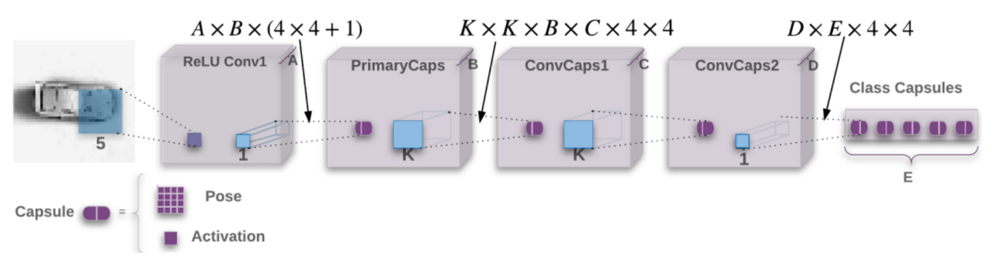

 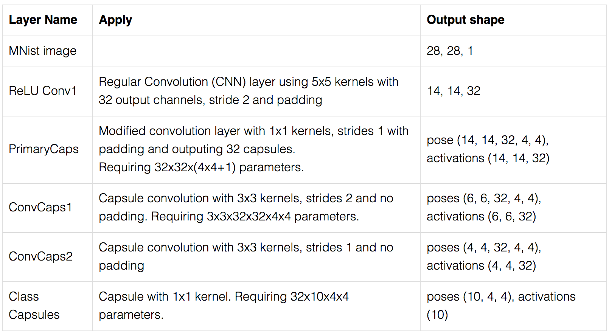

## 参考 资料 
* [Dynamic Routing Between Capsules Blog](https://jhui.github.io/2017/11/03/Dynamic-Routing-Between-Capsules/) 本文主要参考了这一篇博客，所有图片都来自与这篇博客，针对他所说的话有的加上了自己的理解，有的只是单纯的翻译。
* [Dynamic Routing Between Capsules 论文](https://arxiv.org/pdf/1710.09829.pdf)

### 如果有幸，您看完了这篇文章，欢迎批评指正，大家一起进步。